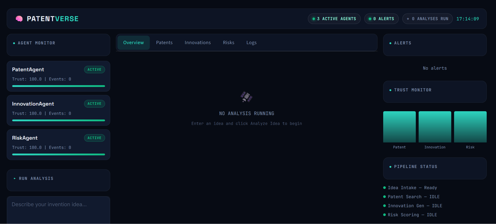
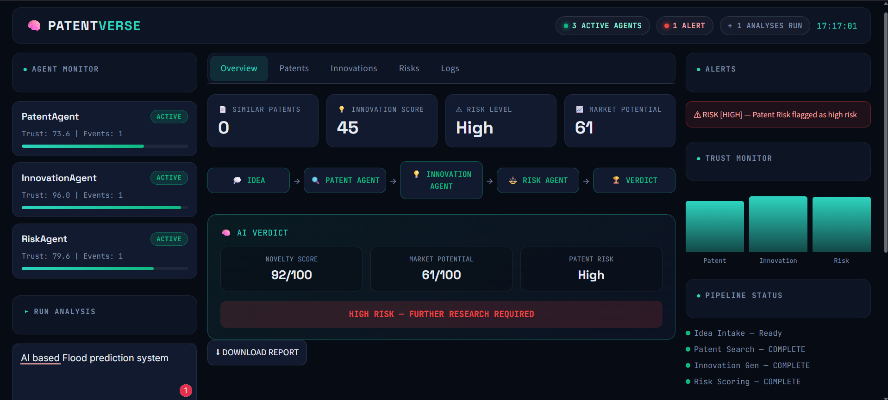
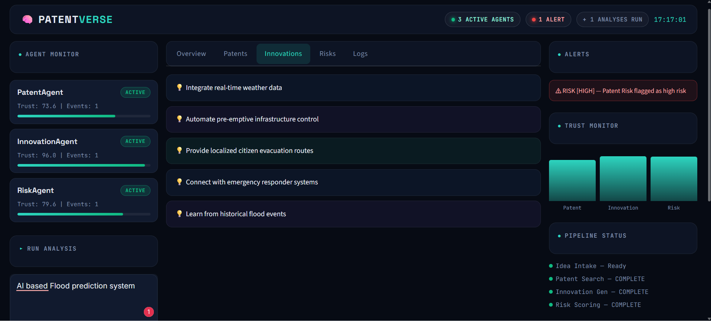
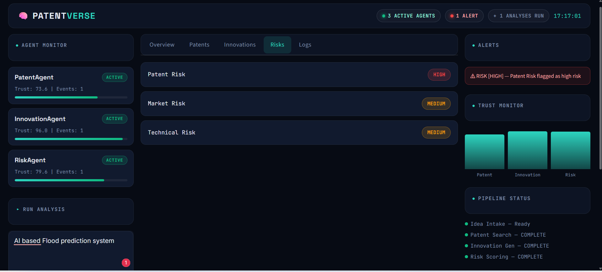
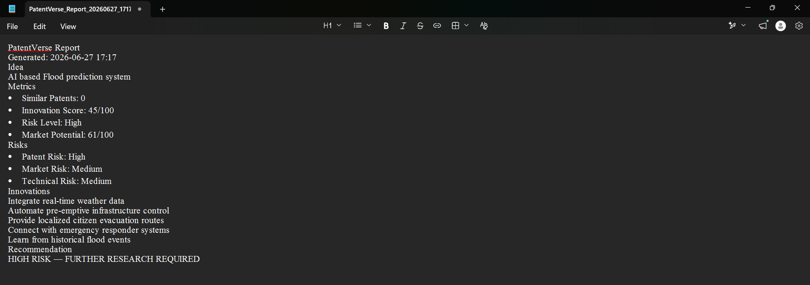
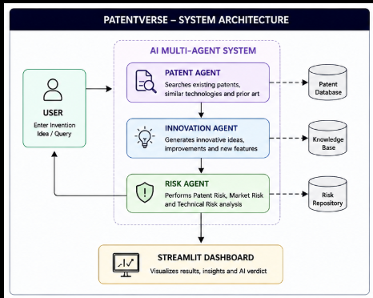
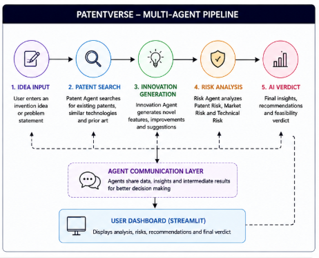
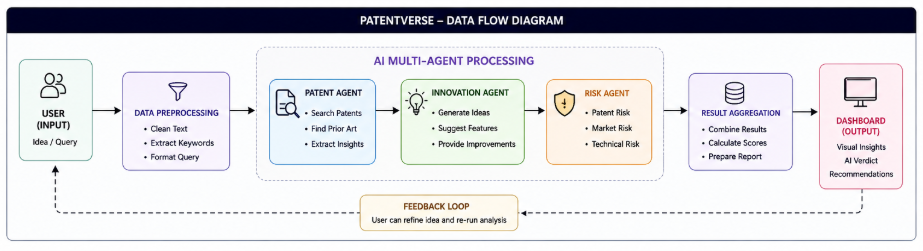

# PatentVerse – AI Patent Intelligence Platform

PatentVerse is an AI-powered multi-agent patent intelligence platform that analyzes invention ideas and generates innovation insights, patent risks, and market evaluations.

The system combines multiple AI agents to simulate an intelligent patent analysis workflow, helping inventors and researchers evaluate ideas before implementation.

---

## Overview

PatentVerse provides:

* Patent analysis
* Innovation suggestion generation
* Risk assessment
* Market evaluation
* Technical feasibility analysis
* Interactive AI dashboard

---

## Features

* Multi-agent architecture
* AI-powered invention analysis
* Innovation suggestion generation
* Patent risk assessment
* Market risk evaluation
* Technical risk analysis
* Real-time AI insights
* Streamlit-based dashboard
* Modern user interface

---

## AI Agents

### Patent Agent

Analyzes invention ideas and identifies similar technologies and patent concepts.

### Innovation Agent

Generates innovative improvements and suggestions using Google Gemini.

### Risk Agent

Evaluates:

* Patent Risk
* Market Risk
* Technical Risk

---

## System Architecture

Input Idea

↓

Patent Agent

↓

Innovation Agent

↓

Risk Agent

↓

PatentVerse Dashboard

---

## Application Screenshots

### Home Page


### Analysis Dashboard


### Innovation Suggestions


### Risk Analysis


### AI Report


---
## System Diagrams

### System Architecture

This diagram illustrates the overall architecture of PatentVerse, showing the interaction between the Streamlit frontend, AI agents, Gemini API, and analysis modules.



---

### Multi-Agent Pipeline

This workflow demonstrates how invention ideas flow through the different AI agents including Patent Agent, Innovation Agent, Risk Agent, and Verdict Generation.



---

### Data Flow Diagram

This diagram explains the flow of data from user input through the AI agents and the generation of analysis results.



---

## Technology Stack

### Frontend

* Streamlit
* HTML
* CSS

### Backend

* Python

### AI

* Google Gemini API

### Libraries

* streamlit
* google-generativeai
* python-dotenv

---

## Project Structure

```text
PatentVerse/
├── agents/
├── services/
├── app/
├── .streamlit/
├── data/
├── diagrams/
├── docs/
├── screenshots/
├── requirements.txt
└── README.md
```

## Installation

Clone the repository:

```bash
git clone https://github.com/USERNAME/PatentVerse.git
cd PatentVerse
```

Install dependencies:

```bash
pip install -r requirements.txt
```

Create a `.env` file:

```env
GEMINI_API_KEY=your_api_key_here
```

Run the application:

```bash
streamlit run app/streamlit_app.py
```
## Installation

Clone the repository:

```bash
git clone https://github.com/Kusuma-Ramesh/PatentVerse.git
cd PatentVerse
```

Install dependencies:

```bash
pip install -r requirements.txt
```

Run the application:

```bash
streamlit run app/streamlit_app.py
```
---
## Google Gemini API Setup

1. Visit Google AI Studio:
   https://aistudio.google.com/

2. Create a free API key.

3. Create a `.env` file in the project root directory.

Example:

```env
GEMINI_API_KEY=your_api_key_here
```

4. Save the file.

The application will automatically load the API key using `python-dotenv`.

---

## Output

PatentVerse provides:

* Innovation suggestions
* Patent analysis
* Market evaluation
* Technical feasibility analysis
* AI-generated recommendations

---
## Important Notes

> [!IMPORTANT]
> This project requires a valid Google Gemini API key to perform patent analysis, innovation generation, and risk assessment.

> [!WARNING]
> The `.env` file containing API credentials is intentionally excluded from this repository for security reasons.

> [!TIP]
> Create a `.env` file in the root directory and add:
>
> ```env
> GEMINI_API_KEY=your_api_key_here
> ```

> [!NOTE]
> The application requires an active internet connection and valid API access to function correctly.

---

## Applications

* Patent research
* Product innovation
* Startup idea validation
* Research projects
* Final year projects
* Technology assessment

---

## Team Members

| Name      | Contribution                             |
| --------- | ---------------------------------------- |
| Kusuma R  | AI Integration and Dashboard Development |
| Meghana R | Patent Analysis Module                   |
| Monikha M | Risk Analysis Module                     |
| Raksha R  | Documentation and Testing                |

Department of Computer Science and Engineering

Final Year Project Team

---

## License

This project is released under the MIT License.
